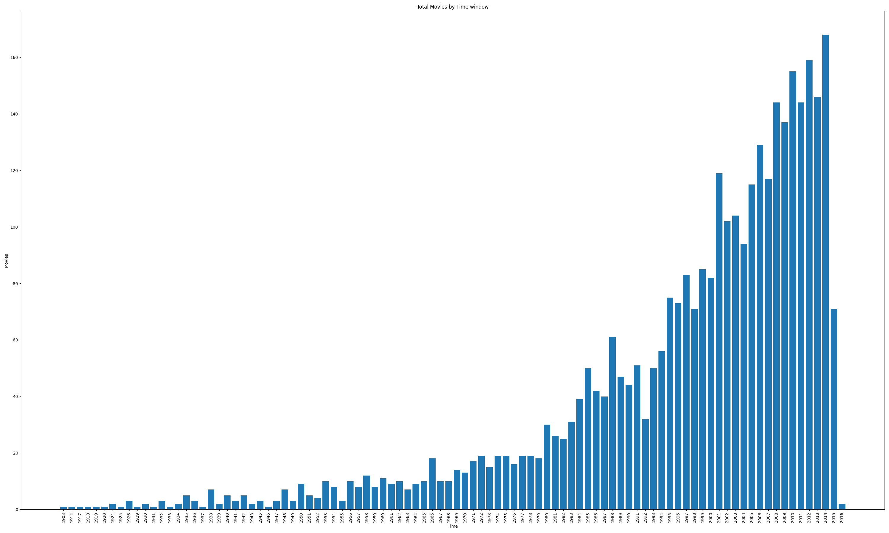
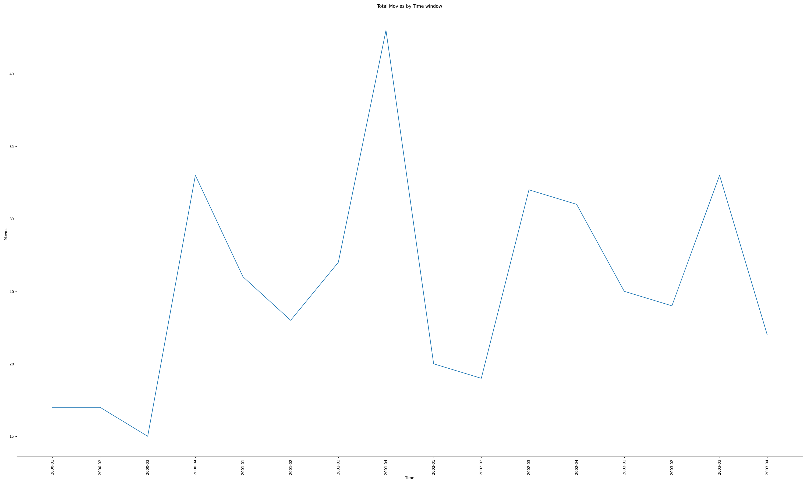

# Forecasting with time series data using Mongo store
The aim of this experiments is to test forecasting of time series data stored in MongoDB. We will perform the experiment with two tools:
1. Simple Python process with primarily relying on [MongoDB aggregation pipelines](https://www.mongodb.com/docs/manual/core/aggregation-pipeline/)
2. PySpark process using [MongoDB Spark Connector](https://www.mongodb.com/docs/spark-connector/v10.2/)

For the Forecasting, we will try to use techniques detailed in these papers: 
1. [Time series forecasting used for real-time
 anomaly detection on websites](https://www.semanticscholar.org/paper/Time-series-forecasting-used-for-real-time-anomaly-Galvas/43aa251f185ac6c85b988f2c0b96572eb0b26bca)
2. [An Introductory Study on Time Series Modeling and Forecasting](https://arxiv.org/abs/1302.6613)

## Data used
MongoDB atlas comes preloaded with a [sample_mflix](https://www.mongodb.com/docs/atlas/sample-data/sample-mflix/#std-label-mflix-movies) database containing data on movies and movie theaters. The movies collection contains details on movies. Each document contains a single movie, and information such as its title, release year, and cast.

It has movies released from 1900 to 2016, containing a total of around 21,000 documents.

A typical document looks like this
```json
{"_id":{"$oid":"673b62683b95a572da4047ac"},"plot":"A group of bandits stage a brazen train hold-up, only to find a determined posse hot on their heels.","genres":["Short","Western"],"runtime":{"$numberInt":"11"},"cast":["A.C. Abadie","Gilbert M. 'Broncho Billy' Anderson","George Barnes","Justus D. Barnes"],"poster":"https://m.media-amazon.com/images/M/MV5BMTU3NjE5NzYtYTYyNS00MDVmLWIwYjgtMmYwYWIxZDYyNzU2XkEyXkFqcGdeQXVyNzQzNzQxNzI@._V1_SY1000_SX677_AL_.jpg","title":"The Great Train Robbery","fullplot":"Among the earliest existing films in American cinema - notable as the first film that presented a narrative story to tell - it depicts a group of cowboy outlaws who hold up a train and rob the passengers. They are then pursued by a Sheriff's posse. Several scenes have color included - all hand tinted.","languages":["English"],"released":{"$date":{"$numberLong":"-2085523200000"}},"directors":["Edwin S. Porter"],"rated":"TV-G","awards":{"wins":{"$numberInt":"1"},"nominations":{"$numberInt":"0"},"text":"1 win."},"lastupdated":"2015-08-13 00:27:59.177000000","year":{"$numberInt":"1903"},"imdb":{"rating":{"$numberDouble":"7.4"},"votes":{"$numberInt":"9847"},"id":{"$numberInt":"439"}},"countries":["USA"],"type":"movie","tomatoes":{"viewer":{"rating":{"$numberDouble":"3.7"},"numReviews":{"$numberInt":"2559"},"meter":{"$numberInt":"75"}},"fresh":{"$numberInt":"6"},"critic":{"rating":{"$numberDouble":"7.6"},"numReviews":{"$numberInt":"6"},"meter":{"$numberInt":"100"}},"rotten":{"$numberInt":"0"},"lastUpdated":{"$date":{"$numberLong":"1439061370000"}}},"num_mflix_comments":{"$numberInt":"0"}}
```

## Analysis from Python with MongoDB Driver
The architecture is along the lines of what's detailed at [MongoDB Aggregation Framework](https://www.practical-mongodb-aggregations.com/intro/introducing-aggregations.html#what-is-mongodbs-aggregation-framework)


To run the Python code, open the folder pymongo from vscode. It will detect devcontainer settings and ask to open in devcontainer. The container has python and mongo settings installed. Add a .env file with the mongodb connection string and run the code with "python mongoagg.py".

The code does the following:
1. Aggregate the data yearly using MongoDB aggregation pipeline
2. Plot the data. It looks as below. As evident, the yearly aggregates show an increasing average. This is the moving average.
3. Aggregate the data quarterly using MongoDB aggregation pipeline
4. Plot the data. The quarterly aggregates show a strong periodicity. Q1 and Q2 is low in terms of moves, while Q3 and Q4 pick up every year. This is the seasonal/periodic component
5. Time series forecasting. This needs to account for both the moving average and seasonal components. TBD

### Moving average by year


## Seasonal trend by quarter


## Analysis from PySpark using Spark Connector
The architecture is along the lines of what's detailed at [spark connector](https://www.mongodb.com/products/integrations/spark-connector)


To run the Pyspark code, open the folder pyspark from vscode. It will detect devcontainer settings and ask to open in devcontainer. The container has python, spark and mongo dependencies installed. Add a .env file with the mongodb connection string and run the code with ./runPySpark.sh

The code does the following:
1. Here we aggregate the data using PySpark functions
2. Aggregate them yearly
3. Aggregate them quarterly.
4. Pay particular attention to
    * Pushdown queries. What is pushed down from compute to storage
    * Compute DAG. How is the DAG run in compute.

## Some observations
### 1. Specification of data logic
In Python with MongoDB driver, the aggregation data logic is specified in a custom DSL of MongoDB API
```python
# Define the aggregation pipeline
pipeline = [
    {
        '$match': {
            # Ensure the timestamp field exists and is not None
            'released': {'$exists': True, '$ne': None}
        }
    },
    {
        '$addFields': {
            'year': {'$year': f'${timestampField}'},
            'month': {'$month': f'${timestampField}'},
            'quarter': {
                '$toInt': {
                    '$ceil': {
                        '$divide': [{'$month': f'${timestampField}'}, 3]
                    }
                }
            }
        }
    },
    {
        '$match': {
            # Ensure the year field exists and is not None
            'year': {'$exists': True, '$ne': None},
            'year': {'$gte': 2010},
            'year': {'$lte': 2015}
        }
    },
    {
        '$group': {
            '_id': {
                'year': '$year',
                'quarter': '$quarter'
            },
            'movies_in_window': {'$sum': 1}
        }
    },
    {
        '$sort': {
            '_id.year': 1,
            '_id.quarter': 1
        }
    }]
```
With PySpark, logic is in code
```python
agg_df = df\
    .filter(col("released").isNotNull())\
    .withColumn("year", year(col("released")))\
    .withColumn("quarter", quarter(col("released")))\
    .filter((df.year >= 2000) & (df.year <= 2005))\
    .groupBy("year", "quarter").count()\
    .sort("year", "quarter", ascending=False)
```

### 2. Storage dependency
   * With Python and MongoDB driver, data logic is tied to MongoDB storage
   * With Spark, data logic is storage independent. MongoDB dependency is only in dataframe intialiization. The data logic in Pyspark will continue to work with different storage drivers

   ```python
   # Read data from MongoDB
   df = spark.read\
      .format("mongodb")\
      .option("database", "sample_mflix")\
      .option("collection", "movies")\
      .load()
   ``` 

### 3. Unit testing
   * With Python and MongoDB driver, the data logic in custom DSL has to be integration tested. 
   * With Spark, we can both unit test by initializing data frame with in-memory list. (Integration testing is also possible)

```python
# Sample data
data = [
    {"title": "Movie 1", "released": "2001-01-01T00:00:00Z"},
    {"title": "Movie 2", "released": "2002-04-15T00:00:00Z"},
    {"title": "Movie 3", "released": "2003-07-20T00:00:00Z"},
    {"title": "Movie 4", "released": "2004-10-30T00:00:00Z"},
    {"title": "Movie 5", "released": "2005-12-25T00:00:00Z"},
    {"title": "Movie 6", "released": None},  # This should be filtered out
    {"title": "Movie 7", "released": ""}     # This should be filtered out
]

# Create DataFrame from the list
df = spark.createDataFrame(data, schema)
```

### 4. Richer set of built-in functions
Pyspark comes with a bigger set of built-in functions. E.g. in the proptotype, "quarter" function was built-in in Spark, while it had to be written in MongoDB DSL.

```python
# PySpark code
.withColumn("quarter", quarter(col("released")))\
```

```python
# MongoDB Aggregation pipeline
{
    '$addFields': {
        'quarter': {
            '$toInt': {
                '$ceil': {
                    '$divide': [{'$month': f'${timestampField}'}, 3]
                }
            }
        }
    }
},
```
A rough count indicates around *180  operators* for MongoDB Aggregation [Aggregation Operators](https://www.mongodb.com/docs/manual/reference/operator/aggregation/)

PySpark seems to have around *500 functions* [Pyspark functions](https://spark.apache.org/docs/latest/api/python/reference/pyspark.sql/functions.html)

### 5. Pushdown to Storage
[Spark Connector documentation](https://www.mongodb.com/products/integrations/spark-connector) indicates: _The MongoDB Connector for Apache Spark can take advantage of MongoDB’s aggregation pipeline and rich secondary indexes to extract, filter, and process only the data it needs_. In this proof of concept, what we're finding is:

* With Python based aggregation pipeline, both filter and aggregation are pushed down to storage
    
* With PySpark aggregation code, filter is pushed down, but aggregation happens in compute, albeit in a distributed way

```console
24/11/18 08:48:01 INFO V2ScanRelationPushDown: 
Pushing operators to MongoTable()
Pushed Filters: IsNotNull(year), IsNotNull(released)
Post-Scan Filters: (cast(year#21 as int) >= 2000),(cast(year#21 as int) <= 2005)
```

```console
== Physical Plan ==
AdaptiveSparkPlan isFinalPlan=false
+- Sort [year#44 DESC NULLS LAST, quarter#67 DESC NULLS LAST], true, 0
+- Exchange rangepartitioning(year#44 DESC NULLS LAST, quarter#67 DESC NULLS LAST, 200), ENSURE_REQUIREMENTS, [plan_id=22]
    +- HashAggregate(keys=[year#44, quarter#67], functions=[count(1)])
        +- Exchange hashpartitioning(year#44, quarter#67, 200), ENSURE_REQUIREMENTS, [plan_id=19]
            +- HashAggregate(keys=[year#44, quarter#67], functions=[partial_count(1)])
            +- Project [year(cast(released#15 as date)) AS year#44, quarter(cast(released#15 as date)) AS quarter#67]
                +- Filter ((cast(year#21 as int) >= 2000) AND (cast(year#21 as int) <= 2005))
                    +- BatchScan MongoTable()[released#15, year#21] MongoScan{namespaceDescription=sample_mflix.movies} RuntimeFilters: []
```

* Time Series forecasting will happen in compute for both. TBD: to check if this can be distributed

* Note that PySpark allows Mongo aggregation pipeline specification, just like Python MongoDB driver does. But in that case, we can't use PySpark functions - but should use the Python Aggregation DSL. This can be used as a trapdoor - for specific cases where Spark aggregation is too suboptimal
